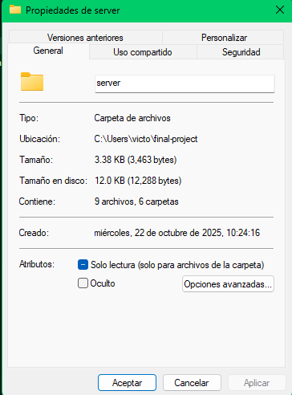

# README — Redes Docker y DNS (bind9)

## Resumen

Documento breve sobre tipos de redes en Docker, zonas y registros en bind9, y comandos útiles para pruebas en un laboratorio con VPN.

---

## Tipos de redes en Docker

- **bridge (Puente)**  
  Driver por defecto. Crea una red virtual interna (NAT) que aísla los contenedores del Host.  
  Ideal para: contenedores que necesitan comunicarse entre sí y exponer puertos al Host.

- **custom bridge**  
  Versión personalizada del bridge donde defines la subred y puedes asignar IPs estáticas.  
  Perfecto para: laboratorios que requieren IPs fijas y conocidas (ej. 192.168.10.20).

- **macvlan**  
  Asigna una MAC e IP de la red física al contenedor, haciéndolo parecer un dispositivo real.  
  Ideal para: contenedores que deben estar en la misma red L2 que el Host o evitar el firewall del Host.

- **host**  
  El contenedor comparte directamente la pila de red del Host. No hay aislamiento.  
  Uso limitado: útil para servicios que requieren acceso total al Host (p.ej. ciertos servidores VPN).

---

## Tipos de zonas en bind9

- **Zona de Búsqueda Directa (Forward Lookup Zone)**  
  Traduce nombres a direcciones IP.  
  Ejemplo: `web.lab.local → 192.168.10.20`.

- **Zona de Búsqueda Inversa (Reverse Lookup Zone)**  
  Traduce direcciones IP a nombres.  
  Ejemplo: `192.168.10.20 → web.lab.local`.

---

## Tipos de registros DNS (resumen)

| Tipo  | Nombre             |                                   Propósito |                         Uso en el proyecto |
| ----- | ------------------ | ------------------------------------------: | -----------------------------------------: |
| A     | Address            |                  Mapea un nombre a una IPv4 | Esencial: `dns.lab.local`, `web.lab.local` |
| NS    | Name Server        |                Indica servidor autoritativo |                Necesario en `db.lab.local` |
| SOA   | Start of Authority | Info administrativa (email, serial, timers) |        Obligatorio en todo archivo de zona |
| PTR   | Pointer            |                       IP → nombre (inversa) |              Esencial para la zona inversa |
| CNAME | Canonical Name     |                   Alias de un nombre a otro |             Útil para nombres alternativos |

---

## Ejemplos y notas de la topología

- Servidor DNS: `192.168.10.10`
- Servidor web: `192.168.10.20`
- El sitio privado solo es accesible desde la VPN (la VPN está en una subred separada).
- Asegurarse de otorgar permisos/ACLs necesarios en la VPN para acceder a `web.lab.local`.



---

## Comandos de prueba

Probar DNS con un contenedor Alpine (instala bind-tools y hace dig):

```bash
docker run --rm --network server_dns_net alpine \
  sh -c "apk add --no-cache bind-tools && dig @192.168.10.10 web.lab.local"
```

Probar Nginx (resuelve `web.lab.local` hacia la IP del servidor web):

```bash
docker run --rm --network server_dns_net appropriate/curl \
  --resolve web.lab.local:80:192.168.10.20 http://web.lab.local/
```

---

## Comandos rápidos para VPN WireGuard

- Encender la VPN:
  ```bash
  sudo wg-quick up wg0
  ```
- Apagar la VPN:
  ```bash
  sudo wg-quick down wg0
  ```

---

## Buenas prácticas rápidas

- Mantener un serial incremental en el SOA cada vez que cambies las zonas.
- Usar IPs estáticas en redes de laboratorio cuando necesites reproducibilidad.
- Configurar registros PTR para todas las IPs importantes si dependes de búsquedas inversas.
- Documentar subredes y reglas de firewall/VPN para evitar problemas de acceso.

# veificar interface wg0

```
 docker exec -it wg-easy wg show
```

# verofocar desde el servidor

```
docker exec -it wg-easy wg show
```

# regla de enmascaramiento

```
sudo firewall-cmd --add-masquerade --permanent
sudo firewall-cmd --add-forward-port=port=51820:proto=udp:toport=51820
sudo firewall-cmd --reload

```

# regla NAT enmascarado

```
sudo iptables -t nat -A POSTROUTING -s 10.8.0.0/24 -o wlo1 -j MASQUERADE
```

# ver mi ip

```
ip addr show wlo1
```

# desactovar syustem resolved

```
sudo systemctl stop systemd-resolved
sudo systemctl disable systemd-resolved

sudo rm -f /etc/resolv.conf
echo "nameserver 8.8.8.8" | sudo tee /etc/resolv.conf


```

# debugg

```
wg-easy
docker exec -it wg-easy tcpdump -i wg0
bind
docker exec -it bind tcpdump -i eth0
```

# Probar conectividad con los servicios en la red VPN

ping 10.8.0.2 # wg-easy
ping 10.8.0.254 # bind

# Probar resolución DNS

nslookup web.lab.local 10.8.0.254

# Si tienes Alpine, instala herramientas DNS

apk update
apk add bind-tools

iptables -t nat -A POSTROUTING -s 10.8.0.0/24 -o eth0 -j MASQUERADE
